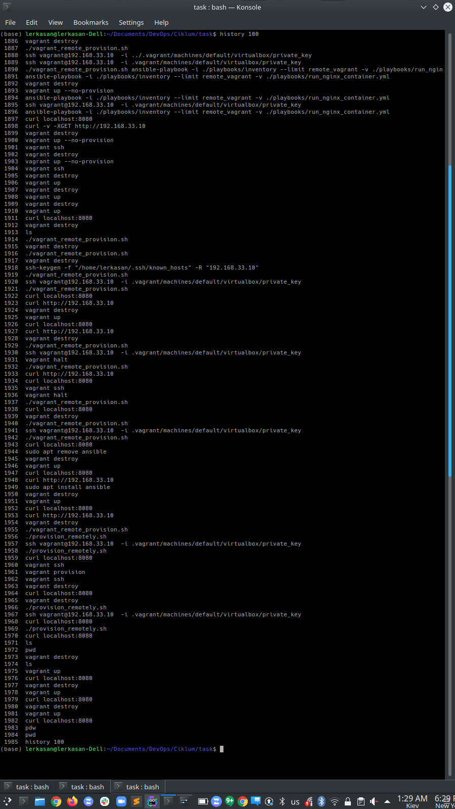
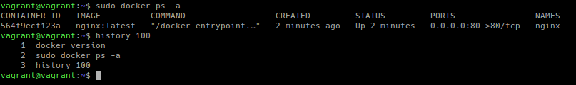
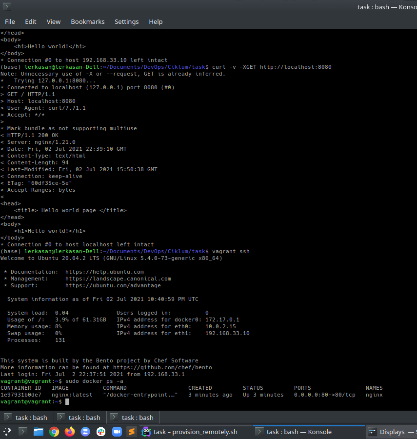
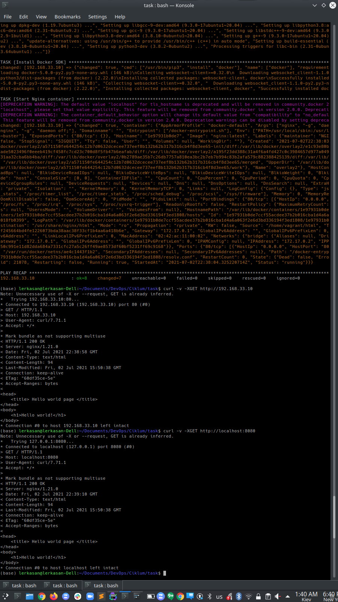
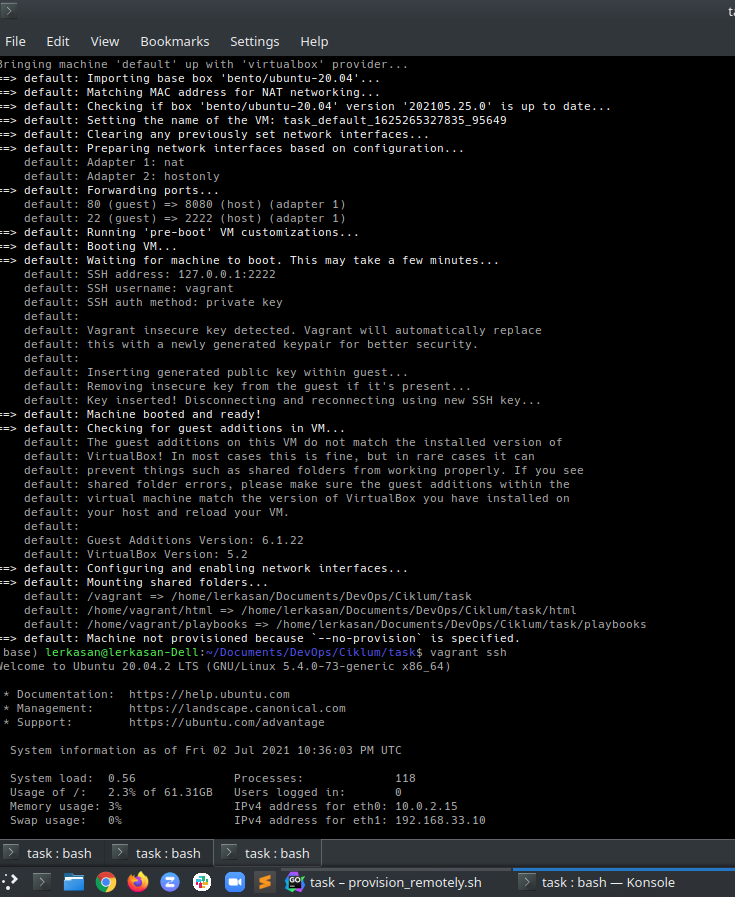

Technologies used in this project:
 - Vagrant
 - Ansible
 - Docker

This project features:
 - automation of a virtual machine creation (using Vagrant)
 - automation of a virtual machine configuration, e.g. installation of Docker  (using Ansible)
 - deployment of a static HTML page using Nginx docker container

**Prerequisites:**
 - VirtualBox (installation script **install_virtualbox_vagrant.sh** is provided for Ubuntu)
 - Vagrant (installation script **install_virtualbox_vagrant.sh** is provided for Ubuntu)

**HowTo**

1. Run **install_virtualbox_vagrant.sh**
2. Run **vagrant up**
_Note: Ansible playbook will be run locally on a virtual machine during its provisioning_

_____Alternatively:_____

1. Run **install_ansible.sh**
4. Run **provision_remotely.sh**
_Note: Ansible playbook will be run on a host machine to provision a virtual machine_

**Results:**

**history 100**

_Host machine_

_Virtual machine_

**docker ps -a**

**curl -v -XGET http://localhost**

**ASCIINEMA**
